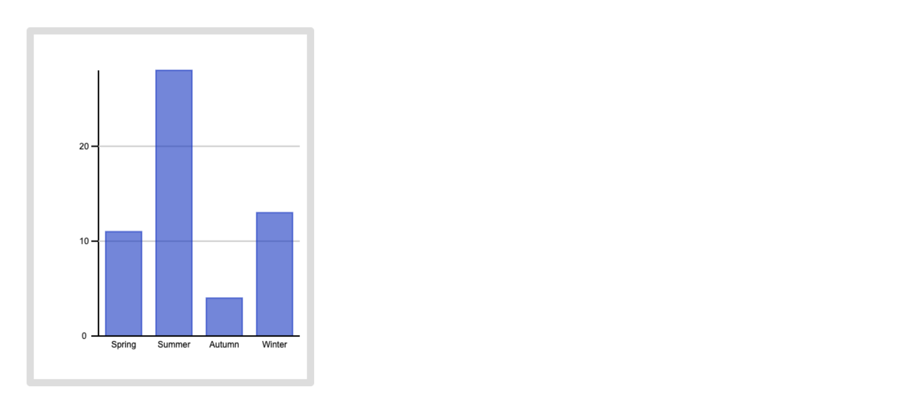

# Test Report
A test report of manual tests for the barcharty module.

## Manual Test Results

|**Test Number**|**Test Description**|**Status**|
|---|---|:---:|
|1|Initialize BarChart|✅|
|2|Add data points|✅|
|3|Set Categories|✅|
|4|Set Random Colors|✅|
|5|Set Color|✅|
|6|Change Height|✅|
|7|Change Width|✅|
|8|Set Title|✅|
|9|Set X-Axis Label|✅|
|10|Set Y-Axis Label|✅|

All tests have passed successfully.

## Tests for barchary module

### Test 1: Initialize BarChart
1. Clone the repository using `git clone https://github.com/miba999/barcharty.git`
   
2. Go to the cloned directory 
   
3. Create an HTML file `index.html`
   
4. Add a `canvas` element with an `id="canvas"` in the body of the HTML file:
```html
<canvas id="canvas"></canvas>
```

5. Create a JavaScript file `test.js`

6. Import the module into the new JavaScript file:
```js
import BarChart from './BarChart.js';
```

7. Import the new JavaScript file to the HTML by adding a script-tag:
```html
<script src="test.js" type="module" ></script>
```

8. Create a new instance of the BarChart class with the canvas id `canvas`:
```js
const barchart = new BarChart('canvas');
```

9. Check that the instance was created without errors.

#### Expected Result: 
No errors should occur, the `barchart` variable should be an instance of the BarChart class. An empty chart should be shown. 


### Test 2: Add data points
1. Add some data points; 11, 28, 4 and 13, for the y axis in the bar chart.
```js
barchart.setData([11, 28, 4, 13]);
```

2. Check that the data points are correctly set in the BarChart instance and that bars have been correctly added to the chart.

#### Expected Result: 
The data points in the provided array should match the the bars in the chart and BarChart instance.


### Test 3: Set Categories
1. Set the categories for the x axis. 

```js
barchart.setCategories(['Spring', 'Summer', 'Autumn', 'Winter']);
```

2. Check that the categories are set on the x axis in the chart and for the BarChart instance. 

#### Expected Result: 
The categories in the chart matches the provided array.


### Test 4: Set Random Colors
1. Set the colors of the bars in the chart to random colors.
```js
barchart.setRandomColors();
```

2. Check that the bars have (probably) different colors. 
#### Expected Result: 
The color of the bars in the bar chart have (probably) different colors.


### Test 5: Set Color
1. Set the colors of the bars in the chart to blue:
```js
barchart.setColor('rgba(10, 50, 200, 0.6)');
```

2. Check that the bars in the chart are blue. 

#### Expected Result: 
The colors of the bars should match the provided color.

 

### Test 6: Change Height
1. Set a new height of 500 pixels for the bar chart.

```js
barchart.setHeight(500);
```

2. Check if the height of the bar chart is updated.

#### Expected Result: 
The bar chart height should match the provided height value.


### Test 7: Change Width
1. Set a new width of 400 pixels for the bar chart.

```js
barchart.setWidth(400);
```

2. Check if the width of the bar chart is updated. 
3. Check the width of the bars. The spacing between the bars has reached a breakpoint and should have been decreased, making the bars fill out more space. 

#### Expected Result: 
The bar chart width should match the provided width value. The spacing between the bars, and also the width of the bars, should also have been updated.



### Test 8: Set Title
1. Set a title for the bar chart:

```js
barchart.setTitle('Favorite season');
```
2. Check if the title is correctly set in the bar chart.

#### Expected Result: 
The title of the bar chart should match the provided string.


### Test 9: Set X-Axis Label
1. Set a label for the x axis

```js
barchart.setXAxisLabel('Seasons');
```
2. Check if the x-axis label is correctly set in the bar chart.

#### Expected Result: 
The x-axis label should match the provided string


### Test 10: Set Y-Axis Label
1. Set a label for the y-axis.

```js
barchart.setYAxisLabel('Number of votes');
```

2. Check if the label for the y-axis is correctly set in the bar chart.


#### Expected Result: 
The y-axis label should match the provided string. 


